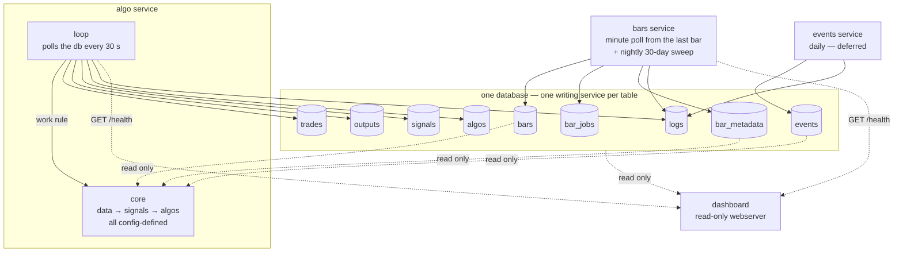

# Trading system redesign: four parts, one writer per table

Status: proposal, 2026-08-17.

## The isolation rule

Three services and one webserver: bars, events, algo, dashboard. All data
lives in one SQLite database. Each table has exactly one writing service;
every other part reads it read-only. Parts communicate through data, never
through calls between services.

| table        | writing service       | readers         |
| ------------ | --------------------- | --------------- |
| bars         | bars                  | algo, dashboard |
| bar_jobs     | bars                  | bars            |
| bar_metadata | bars                  | algo, dashboard |
| events       | events                | algo, dashboard |
| trades       | algo                  | dashboard       |
| outputs      | algo                  | dashboard       |
| signals      | algo                  | dashboard       |
| algos        | algo                  | dashboard       |
| logs         | every service, own rows only | dashboard |

One shared config file holds the ticker list, the signal and algo
definitions, the early-close days, the live-polling window, and the
evaluation window (a day count). Inputs: bars and events take the ticker
list; algo takes the ticker list plus the signal and algo definitions.

There is no calendar table. The early close is the only session fact that
cannot be inferred, and it lives in config. Time of day comes from the
timestamp, a holiday is a day with no bars, and the prior session is a data
walk.

## 1. bars (service)

Collects minute bars from Robinhood and preserves their source quality. One
process does the initial backfill, live poll, and nightly sweep. Writes are
idempotent upserts keyed by ticker and timestamp, so a repeated fetch is
harmless. Every write stamps `fetched_at`, so a reader can see what changed and
when.

Initial backfill:

- Fetch minute bars from the configured fixed history start once for each ticker.
- Record the fixed window, per-session progress, and completion in `bar_jobs`.
  A failed backfill resumes after its last committed session, while a completed
  ticker does not repeat the initial fetch.
- A ticker added to config gets the same fixed-start backfill before its next poll or
  sweep.

Live poll:

- Active from premarket until a set time after the close; the window is in
  config.
- Polls once per minute and writes minute bars.
- Every poll starts from the last stored bar, so an outage catches up by
  itself. Each poll fetches at most seven calendar days, so a long outage
  catches up in bounded steps. No reconcile step exists.
- A response must contain every requested ticker. An omitted ticker fails the
  cycle and retries; it is never treated as successful progress.

Nightly sweep:

- Once per day, after the close, in bulk: the last 30 days of minute bars
  for every ticker, always, with no gap detection. The sweep is the gap
  repair.
- Robinhood can return synthetic gap-fill bars at any age and marks them with
  `interpolated: true`. Older minute requests can contain only these rows.
- Store every returned bar and preserve the `interpolated` flag so each reader
  can decide how to use it.

Bar metadata:

- The provider also computes per-bar values over the same bars, such as RSI,
  MACD, Bollinger Bands, ATR, VWAP, ADX, and channels. Bars pulls the values
  that config declares and writes them to `bar_metadata`.
- A row is one value for one bar. The key is ticker, timestamp, name, and
  params, so two periods of the same name live side by side.
- Bars fetches a range and stores the series during the sweep, not the minute
  poll. Every sweep refreshes the trailing sweep window. A failed sweep resumes
  after its last metadata chunk from that run.
- Bars is the only process that holds the provider token. No other service
  calls the provider, and no service calls Bars.

## 2. events (service)

Deferred: this service is not part of the current build. The section below
is the contract for when it is; nothing reads events until the sentiment
signal exists.

- Collects events, maps each one to a ticker, and defines the date range
  where the event has impact.
- A row: ticker, event, event time, window start, window end, direction,
  strength. Direction is a value from -1 to 1, and 0 is neutral. Strength
  is the size of the impact; a high strength means high expected
  volatility.
- A non-directional event (earnings, implied move) stores direction 0 with
  a high strength.
- Cadence: once per day, before the open. A run upserts the current facts
  and deletes a future row that its source no longer lists. A row with an
  ended window stays forever as history.

The service also defines the impact formula. For a date `d` inside the
window, the weight is 0 at the window edges, 1 at the event time, and
linear between; the impact is the weight times (direction, strength).
Outside the window the impact is (0, 0). The read interface returns each
active event with its impact and does not consolidate across events.
Consolidation belongs to a signal: a planned sentiment signal will produce
one (direction, strength) from events, bars, or both. That signal is a
separate task.

## 3. algo (service)

One service runs the algos and contains the algo logic: a core plus a
loop. Input: the ticker list and the signal and algo definitions; the
bar timestamps supply `t`. One call carries all work:
`core(ticker, t, algos=None)` returns the signal values at `t` and one
`(is_entry, is_close_all, direction)` result per algo. `direction` is `1` for
long, `-1` for short, and `0` when the algo is quiet. `algos=None` runs every enabled
algo; a list restricts the call to those algos.

### The core

- No clock, no side effects. Data input: the bars, bar_metadata, events, and
  prior outputs tables, read-only.
- Two layers with a strict rule: a signal (vwap, sma, and so on) queries
  bars, bar metadata, the events table, and other signals; an algo queries
  signal outputs, the outputs of other algos, and its own prior outputs.
- Algos are independent. Nothing combines them; to combine behavior,
  compose an algo from other algos. Every entry and exit belongs to
  exactly one algo. An algo that another algo reads evaluates like a
  signal; whether it also trades is its own config flag.
- A signal's output is opaque: a number for sma, a pair, anything. The algo
  that reads a signal interprets the output itself.
- Everything reads only values at or before `t` — the whole no-lookahead
  guarantee.
- Each algo's config declares the signals it reads. A new signal or algo is
  a config entry, not an engine change.
- Bulk and real time are the same core with different timestamps.

### The algo output contract

- Input: besides its signals, an algo receives its simulated open entries at
  `t` from its own prior live outputs. Entry prices come from bars.
- Output at `t` is `(is_entry, is_close_all, direction)`. The first two values
  are booleans and direction is `1`, `-1`, or `0`. The
  algo decides among three moves from its open entries: `is_entry` opens
  one more unit, `is_close_all` closes every open unit, and both false is
  quiet. Both true does not occur.
- An exit device such as a bracket lives inside the algo: the open entries give
  the anchor and declared signals provide the current levels.
- Historical position state lives in the database only: open units are entry
  outputs since the last close output. Live
  trade state is the entries since the last `exit_all` in trades. The loop
  keeps no position in memory. Work under one ticker runs oldest first, so an
  algo's prior outputs exist when it reads them.
- The triple is the one fixed shape in outputs, because the loop and the
  dashboard both read it. A signal's output stays opaque JSON.

### Config defines every signal and every algo

- A signal and an algo have the same shape in config: an entry in a
  name-keyed map with `inputs` and `params`. Example:

  ```json
  "signals": {
    "sma20": { "inputs": ["bars"], "params": { "length": 20 } },
    "rsi14": { "inputs": ["bar_metadata"],
               "params": { "name": "rsi", "period": 14 } },
    "shape": { "inputs": ["bars"], "function": "shape_v1", "params": {} }
  },
  "algos": {
    "dip": { "inputs": ["sma20"],
             "params": { "drop_pct": 1.5, "trail_pct": 0.8 } }
  }
  ```

- The map key is the name, and it is the `kind` value in outputs. Presence
  in the map means enabled; to disable a node, remove the entry.
- `inputs` declares what a node reads. Every algo action writes a trade row.
- A `bar_metadata` input is also the fetch order. Bars reads the same config
  file and keeps the declared names populated. No service requests a fetch.
  The `name` param is the provider value; the rest are its parameters.
- All parameters live in `params`. A complicated node adds `function`,
  which points to a function in the code, and the function hard-codes
  nothing.
- The live `algos` table stores each current algorithm definition and its
  effective signal and algorithm dependencies. Live definitions have no ID.
- Git and `config/config.json` are the algorithm-definition history. The
  database stores only the current effective definition.

### A change is a standard operation

Add a signal, add an algo, or change a parameter by editing the config file.
The algo service reacts on its own:

1. It validates and applies the new live definitions immediately.
2. The service clears derived live outputs and affected trades, then refills
   the evaluation window. The rows are keyed, so the run is resumable.
3. The dashboard shows the current algorithm definition and rebuilt results.

Easy: one file edit, no deploy. Fast: the work is bounded by the
evaluation window, never by the full history. 

### The output cache

Every evaluation is stored in outputs: one live row per signal or algorithm,
keyed by ticker, timestamp, and name, and stamped with `computed_at`. A rerun
updates that row in place. Definition history lives in Git, not in the live
database. The dashboard reads the cache and never writes it.

Every enabled signal is evaluated and stored each tick, whether or not an
algo reads it. A visual-aid signal, such as a shape forecast, is stored the
same way, and the JSON output holds a series or a shape as easily as a
number.

### The loop

- No private clock. The loop polls the database and the config file every
  30 seconds and reacts to what changed.
- The work list is every (ticker, timestamp) pair inside the evaluation
  window where outputs has no live completion row. This one
  rule covers a live bar and a config change; the loop does not tell the
  cases apart.
- Every enabled algo runs for every configured ticker. Algo definitions have
  no separate ticker scope.
- Work updates outputs; a rerun is a safe upsert because the rows are
  keyed and the core is deterministic.
- A trade row is ticker, algo, exact timestamp, action, and direction. `is_entry` writes
  an entry row and opens one unit. `is_close_all` writes an `exit_all` row
  and closes every open unit of the algo.
- An algo exits only while it has open units for the ticker. This is
  enforced in code; a CHECK cannot span rows.
- A trade has no size: the unit is the size. Performance is the percent
  result per unit, and the account result is the sum over units. The price
  of a point at `t` is the close of bar `t`.

## 4. dashboard (webserver)

Shows the state as it happens. It reads the whole database read-only,
renders vertical-first so a phone screen works, writes nothing, and triggers
nothing. Data views come from the tables. Service liveness comes from local,
read-only health APIs.

| view                                       | source                                  |
| ------------------------------------------ | --------------------------------------- |
| minute-bar chart over all days             | bars                                    |
| entry and exit overlays on the bars        | trades, per algo                        |
| click-through detail of a signal or algo   | outputs + current config                |
| current algo performance                   | outputs and trades, priced by bars      |
| visual-aid signals, e.g. a shape forecast  | outputs, like any signal                |
| service status                             | local health APIs                       |
| service history and problems               | logs                                    |

Ad-hoc views may call the core directly; the call writes nothing.

## Service status and logs

Bars and Algo each expose `GET /health` on a loopback-only port. Dash calls
them to check process liveness; the calls write nothing. Each service appends
only completed work summaries and problems to the logs table, not periodic
heartbeats or idle-cycle rows. The dashboard reads logs for history, warnings,
and errors. The table remains safe because it is append-only and each service
writes only rows tagged with its own name.

## Database schema

```sql
PRAGMA journal_mode = WAL;

CREATE TABLE bars (
    ticker     TEXT    NOT NULL,
    ts         INTEGER NOT NULL,  -- bar start, epoch seconds, UTC
    open       REAL    NOT NULL,
    high       REAL    NOT NULL,
    low        REAL    NOT NULL,
    close      REAL    NOT NULL,
    volume     INTEGER NOT NULL,
    interpolated INTEGER NOT NULL DEFAULT 0,  -- Robinhood gap-fill flag
    fetched_at INTEGER NOT NULL,  -- write time, epoch seconds, UTC
    PRIMARY KEY (ticker, ts),
    CHECK (interpolated IN (0, 1))
);

CREATE TABLE bar_jobs (
    kind         TEXT    NOT NULL,  -- backfill or sweep
    scope        TEXT    NOT NULL,  -- ticker, or all for a sweep
    target       TEXT    NOT NULL,  -- history start, or scheduled sweep date
    window_start INTEGER NOT NULL,
    window_end   INTEGER NOT NULL,
    progress_ts  INTEGER,           -- last committed provider session
    started_at   INTEGER NOT NULL,
    completed_at INTEGER,
    PRIMARY KEY (kind, scope, target),
    CHECK (kind IN ('backfill', 'sweep')),
    CHECK (window_start <= window_end),
    CHECK (progress_ts IS NULL OR
           (window_start <= progress_ts AND progress_ts <= window_end)),
    CHECK (completed_at IS NULL OR progress_ts IS NOT NULL)
);

CREATE TABLE bar_metadata (
    ticker     TEXT    NOT NULL,
    ts         INTEGER NOT NULL,  -- the bar it belongs to, epoch seconds, UTC
    name       TEXT    NOT NULL,  -- the provider value, e.g. 'rsi'
    params     TEXT    NOT NULL,  -- the request parameters, JSON
    value      TEXT    NOT NULL,  -- JSON
    fetched_at INTEGER NOT NULL,  -- write time, epoch seconds, UTC
    PRIMARY KEY (ticker, ts, name, params)
);

CREATE TABLE events (
    ticker       TEXT    NOT NULL,
    event        TEXT    NOT NULL,  -- kind, e.g. 'earnings'
    event_ts     INTEGER NOT NULL,  -- the event time, the impact peak
    window_start INTEGER NOT NULL,
    window_end   INTEGER NOT NULL,
    direction    REAL    NOT NULL DEFAULT 0,  -- -1 to 1; 0 is neutral
    strength     REAL    NOT NULL DEFAULT 0,  -- high = high volatility
    PRIMARY KEY (ticker, event, event_ts),
    CHECK (window_start <= event_ts AND event_ts <= window_end),
    CHECK (direction >= -1 AND direction <= 1),
    CHECK (strength >= 0)
);

CREATE TABLE trades (
    ticker TEXT    NOT NULL,
    algo   TEXT    NOT NULL,
    ts     INTEGER NOT NULL,  -- exact entry or exit time, epoch seconds, UTC
    action TEXT    NOT NULL,
    direction INTEGER NOT NULL DEFAULT 1,  -- 1 long, -1 short
    PRIMARY KEY (ticker, algo, ts, action),
    CHECK (action IN ('entry', 'exit_all')),
    CHECK (direction IN (-1, 1))
);

CREATE TABLE outputs (
    ticker      TEXT    NOT NULL,
    ts          INTEGER NOT NULL,
    kind        TEXT    NOT NULL,  -- a signal name or an algo name
    output      TEXT    NOT NULL,  -- JSON
    computed_at INTEGER NOT NULL,  -- evaluation time, epoch seconds, UTC
    PRIMARY KEY (ticker, ts, kind)
);

CREATE TABLE signals (
    name       TEXT    NOT NULL PRIMARY KEY,
    definition TEXT    NOT NULL,  -- current config definition, JSON
    updated_at INTEGER NOT NULL
);

CREATE TABLE algos (
    name         TEXT    NOT NULL PRIMARY KEY,
    definition   TEXT    NOT NULL,  -- current algo definition, JSON
    dependencies TEXT    NOT NULL,  -- effective signal/algo inputs, JSON
    active_from  INTEGER NOT NULL
);

CREATE TABLE logs (
    ts      INTEGER NOT NULL,  -- epoch seconds, UTC
    service TEXT    NOT NULL,  -- bars, events, algo
    level   TEXT    NOT NULL,
    message TEXT    NOT NULL,
    CHECK (level IN ('info', 'warn', 'error'))
);
CREATE INDEX logs_service_ts ON logs (service, ts);
```

Notes:

- WAL: readers never block the writer. Each process has its own connection
  and busy timeout. All timestamps are epoch seconds, UTC.
- Bar writes are idempotent upserts; a repeated fetch is harmless.
- `bar_jobs` holds resumable work state. Logs describe runs and problems but
  never control work.
- `bars.interpolated` preserves Robinhood's gap-fill flag; no returned bar is
  discarded at ingest.
- `bar_metadata` holds provider values, not computed ones. `params` is in the
  key, so one name can hold two parameter sets. A signal that a function can
  compute from bars belongs in `outputs`, not here.
- `trades` binds every row to one algo and direction; nothing consolidates
  across algos. No price (recomputable) and no size (a row is one unit).
- `outputs` grows fastest; `logs` grows steadily.
- `algos` contains only live definitions and has no version column.
- `logs` is append-only and has supporting indexes.
- Config stays in files and is applied immediately after validation.

## Diagram



## Decisions (2026-08-17)

1. No calendar table; the early-close days live in config.
2. No backtest concept: the loop applies the core to timestamps, in bulk
   or in real time. Each live output updates in place.
3. Live state has no version. Git and `config/config.json` are the source for
   current and prior algorithm definitions.
4. Bar metadata comes from bars, never from algo. The handoff is a table, not
   a call, so the core stays deterministic and each service restarts alone.
   Config declares what to pull; nothing requests a fetch.
