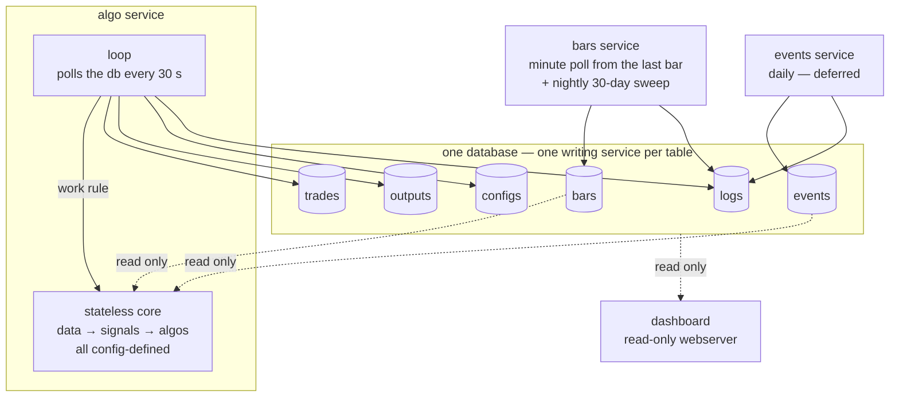

# Trading system redesign: four parts, one writer per table

Status: proposal, 2026-08-17.

## The isolation rule

Three services and one webserver: bars, events, algo, dashboard. All data
lives in one SQLite database. Each table has exactly one writing service;
every other part reads it read-only. Parts communicate through data, never
through calls between services.

| table   | writing service       | readers         |
| ------- | --------------------- | --------------- |
| bars    | bars                  | algo, dashboard |
| events  | events                | algo, dashboard |
| trades  | algo                  | dashboard       |
| outputs | algo                  | dashboard       |
| configs | algo                  | dashboard       |
| logs    | every process, own rows only | dashboard |

One shared config file holds the ticker list, the signal and algo
definitions, the early-close days, the live-polling window, and the
evaluation window (a day count). Inputs: bars and events take the ticker
list; algo takes the ticker list plus the signal and algo definitions.

There is no calendar table. The early close is the only session fact that
cannot be inferred, and it lives in config. Time of day comes from the
timestamp, a holiday is a day with no bars, and the prior session is a data
walk.

## 1. bars (service)

Collects minute bars from Robinhood and owns their quality. One process
does both jobs: a live poll each minute and a nightly sweep. Writes are
idempotent upserts keyed by ticker and timestamp, so a repeated fetch is
harmless. Every write stamps `fetched_at`, so a reader can see what
changed and when.

Live poll:

- Active from premarket until a set time after the close; the window is in
  config.
- Polls once per minute and writes minute bars.
- Every poll starts from the last stored bar, so an outage catches up by
  itself. No reconcile step exists.

Nightly sweep:

- Once per day, after the close, in bulk: the last 30 days of minute bars
  for every ticker, always, with no gap detection. The sweep is the gap
  repair.
- 30 days sits inside the ~41-day boundary where Robinhood starts to serve
  synthetic bars (marked only by `interpolated: true`), so every fetched bar
  is real.
- Simple validation: drop interpolated rows and rows with unordered prices,
  write the rest.

## 2. events (service)

Deferred: this service is not part of the current build. The section below
is the contract for when it is; nothing reads events until the sentiment
signal exists.

- Collects events, maps each one to a ticker, and defines the date range
  where the event has impact.
- A row: ticker, event, event time, window start, window end, direction,
  strength. Direction is a value from -1 to 1, and 0 is neutral. Strength
  is the size of the impact; a high strength means high expected
  volatility.
- A non-directional event (earnings, implied move) stores direction 0 with
  a high strength.
- Cadence: once per day, before the open. A run upserts the current facts
  and deletes a future row that its source no longer lists. A row with an
  ended window stays forever as history.

The service also defines the impact formula. For a date `d` inside the
window, the weight is 0 at the window edges, 1 at the event time, and
linear between; the impact is the weight times (direction, strength).
Outside the window the impact is (0, 0). The read interface returns each
active event with its impact and does not consolidate across events.
Consolidation belongs to a signal: a planned sentiment signal will produce
one (direction, strength) from events, bars, or both. That signal is a
separate task.

## 3. algo (service)

One service runs the algos and contains the algo logic: a stateless core
plus a loop. Input: the ticker list and the signal and algo definitions; the
bar timestamps supply `t`. One call carries all work:
`core(ticker, t, algos=None)` returns the signal values at `t` and the entry
and exit points per algo.

### The stateless core

- A pure function; no clock, no side effects. Data input: the bars and
  events tables, read-only.
- Two layers with a strict rule: a signal (vwap, sma, and so on) queries
  bars, the events table, and other signals; an algo queries signal outputs
  and the outputs of other algos.
- Algos are independent. Nothing combines them; to combine behavior,
  compose an algo from other algos. Every entry and exit belongs to
  exactly one algo. An algo that another algo reads evaluates like a
  signal; whether it also trades is its own config flag.
- A signal's output is opaque: a number for sma, a pair, anything. The algo
  that reads a signal interprets the output itself.
- Everything reads only values at or before `t` — the whole no-lookahead
  guarantee.
- Each algo's config declares the signals it reads. A new signal or algo is
  a config entry, not an engine change.
- Bulk and real time are the same core with different timestamps.

### Config defines every signal and every algo

- A signal and an algo have the same shape in config: name, parameters,
  inputs.
- All parameters live in config. A complicated node points to a function in
  the code, and the function hard-codes nothing.
- The version is one hash of the whole config file; there is no per-node
  hash. When the algo service sees a new version, it writes the full file
  to the configs table. A stored version therefore always resolves to
  readable parameters, also after the config file has moved on.

### A change is a standard operation

Add a signal, add an algo, or change a parameter: edit the config file.
That is the whole procedure. The algo service reacts on its own:

1. It sees the new file hash and stores the file in configs.
2. The work rule (see the loop) now matches every pair in the evaluation
   window, because no output rows exist under the new version, and fills
   them. The rows are keyed, so the run is idempotent and resumable.
3. The dashboard shows the new version next to the old ones as the rows
   land.

Easy: one file edit, no deploy. Fast: the work is bounded by the
evaluation window, never by the full history. Visible: history for the
new version appears without a live bar. A new function is the one case
that also needs a code change.

### The output cache

Every evaluation is stored in outputs: one row per signal and one per algo,
keyed by ticker, timestamp, name, and the config version, stamped with
computed_at. A rerun under the same version updates the row in place; a
changed config writes rows under a new version, and the old rows stay for
reference. The dashboard reads the cache and never writes it.

Every enabled signal is evaluated and stored each tick, whether or not an
algo reads it. A visual-aid signal, such as a shape forecast, is stored the
same way, and the JSON output holds a series or a shape as easily as a
number.

### The loop

- No private clock. The loop polls the database and the config file every
  30 seconds and reacts to what changed.
- The work list is every (ticker, timestamp) pair inside the evaluation
  window where outputs has no row under the current version, or where the
  bar's fetched_at is newer than the output row's computed_at. This one
  rule covers a live bar, a bar the sweep repaired, and a config change;
  the loop does not tell the cases apart.
- Work updates outputs; a rerun is a safe upsert because the rows are
  keyed and the core is deterministic. Only the newest bar of a ticker
  also trades: the loop writes trade rows for its points, and older work
  never writes a trade.
- A trade row is ticker, algo, exact timestamp, action. An entry opens one
  unit. An exit closes one unit or all of the algo's open units; the
  algo's point says which. An exit for one unit closes the oldest open
  entry.
- An algo exits only while it has open units for the ticker. This is
  enforced in code; a CHECK cannot span rows.
- A trade has no size: the unit is the size. Performance is the percent
  result per unit, priced from bars, and the account result is the sum
  over units.

## 4. dashboard (webserver)

Shows the state as it happens. It reads the whole database read-only,
renders vertical-first so a phone screen works, writes nothing, and triggers
nothing. No service exposes an API; every view is served by the tables.

| view                                       | source                                  |
| ------------------------------------------ | --------------------------------------- |
| minute-bar chart over all days             | bars                                    |
| entry and exit overlays on the bars        | trades, per algo                        |
| click-through detail of a signal or algo   | outputs (values) + configs (parameters) |
| algo performance across parameter sets     | outputs across versions, priced by bars |
| visual-aid signals, e.g. a shape forecast  | outputs, like any signal                |
| service status, history, problems          | logs                                    |

Ad-hoc views may call the core directly; a pure call is a read.

## Service status (logs)

Every process appends to the logs table: a heartbeat each cycle, a summary
row per run (bars fetched, rows rejected), and a row per problem. The
dashboard derives everything from it: status is the freshest heartbeat per
process, history is the run summaries, and problems are the warn and error
rows. This is the one shared-writer table; it is safe because it is
append-only and each process writes only rows tagged with its own name.

## Database schema

```sql
PRAGMA journal_mode = WAL;

CREATE TABLE bars (
    ticker     TEXT    NOT NULL,
    ts         INTEGER NOT NULL,  -- bar start, epoch seconds, UTC
    open       REAL    NOT NULL,
    high       REAL    NOT NULL,
    low        REAL    NOT NULL,
    close      REAL    NOT NULL,
    volume     INTEGER NOT NULL,
    fetched_at INTEGER NOT NULL,  -- write time, epoch seconds, UTC
    PRIMARY KEY (ticker, ts)
) WITHOUT ROWID;

CREATE TABLE events (
    ticker       TEXT    NOT NULL,
    event        TEXT    NOT NULL,  -- kind, e.g. 'earnings'
    event_ts     INTEGER NOT NULL,  -- the event time, the impact peak
    window_start INTEGER NOT NULL,
    window_end   INTEGER NOT NULL,
    direction    REAL    NOT NULL DEFAULT 0,  -- -1 to 1; 0 is neutral
    strength     REAL    NOT NULL DEFAULT 0,  -- high = high volatility
    PRIMARY KEY (ticker, event, event_ts),
    CHECK (window_start <= event_ts AND event_ts <= window_end),
    CHECK (direction >= -1 AND direction <= 1),
    CHECK (strength >= 0)
) WITHOUT ROWID;

CREATE TABLE trades (
    ticker TEXT    NOT NULL,
    algo   TEXT    NOT NULL,
    ts     INTEGER NOT NULL,  -- exact entry or exit time, epoch seconds, UTC
    action TEXT    NOT NULL,
    PRIMARY KEY (ticker, algo, ts, action),
    CHECK (action IN ('entry', 'exit', 'exit_all'))
) WITHOUT ROWID;

CREATE TABLE outputs (
    ticker      TEXT    NOT NULL,
    ts          INTEGER NOT NULL,
    kind        TEXT    NOT NULL,  -- a signal name or an algo name
    config      TEXT    NOT NULL,  -- the config file version
    output      TEXT    NOT NULL,  -- JSON
    computed_at INTEGER NOT NULL,  -- evaluation time, epoch seconds, UTC
    PRIMARY KEY (ticker, ts, kind, config)
) WITHOUT ROWID;

CREATE TABLE configs (
    version    TEXT    NOT NULL PRIMARY KEY,  -- hash of the whole config file
    first_seen INTEGER NOT NULL,              -- epoch seconds, UTC
    content    TEXT    NOT NULL               -- the full config file, JSON
) WITHOUT ROWID;

CREATE TABLE logs (
    ts      INTEGER NOT NULL,  -- epoch seconds, UTC
    service TEXT    NOT NULL,  -- bars, events, algo
    level   TEXT    NOT NULL,
    message TEXT    NOT NULL,
    CHECK (level IN ('info', 'warn', 'error'))
);
CREATE INDEX logs_service_ts ON logs (service, ts);
```

Notes:

- WAL: readers never block the writer. Each process has its own connection
  and busy timeout. All timestamps are epoch seconds, UTC.
- Bar writes are idempotent upserts; a repeated fetch is harmless.
- `bars` needs no quality flag: bad rows are rejected at ingest.
- `trades` binds every row to one algo; nothing consolidates across algos.
  No price (recomputable) and no size (a row is one unit).
- The loop's work rule compares `bars.fetched_at` with
  `outputs.computed_at`; the two columns exist for that rule.
- `outputs` grows fastest; `logs` grows steadily.
- `configs` maps every stored version hash back to the full config file.
- `logs` is append-only and the one table with a rowid and an extra index.
- No other indexes beyond the primary keys. Config stays in files; the
  configs table is a record of versions, not the source of truth.

## Diagram



## Decisions (2026-08-17)

1. No book, no counters, no size: a trades row is one unit and belongs to
   one algo. Counts are queries; performance is the percent result per
   unit, summed over units.
2. One database; isolation is per-table ownership.
3. One shared config file.
4. The runner and the algo library merged into the algo service; the core
   stays a pure function.
5. The algo service stays a separate process; bars never triggers trading.
6. No calendar table; the early-close days live in config.
7. Outputs stored as cache and history, keyed by the config file version.
8. Bars: one process; a live poll from the last bar each minute, plus a
   nightly 30-day bulk sweep; minute bars only.
9. Inputs: the ticker list for bars and events; the ticker list plus the
   definitions for algo.
10. Signals and algos are config-defined, config-versioned, and layered:
    signals read data and signals; algos read signals and other algos.
11. A signal's output is opaque, and the consuming algo interprets it. The
    events service owns the per-event impact formula; consolidation across
    events belongs to a planned sentiment signal, a separate task.
12. The dashboard is served entirely by the tables; no service exposes an
    API. A configs table maps every stored version hash to the full config
    file, and every enabled signal is stored each tick, so visual-aid
    signals reach the dashboard without an algo consumer.
13. Service status goes through an append-only logs table: heartbeats, run
    summaries, and problems, each process writing only its own rows. The
    dashboard derives status, history, and problems from it.
14. The version is one hash of the whole config file; per-node composite
    hashes were dropped.
15. A change is a standard operation: the algo service detects the new
    file version and backfills outputs over the evaluation window. A bulk
    run writes outputs and no trades.
16. An event's impact is (direction, strength): direction is a value from
    -1 to 1, and a high strength means high expected volatility. The
    separate volatility column and known_at are gone.
17. No backtest concept: the loop applies the core to timestamps, in bulk
    or in real time. An output updates in place per version; old versions
    stay for reference.
18. Algos are independent; nothing consolidates across them. Composition
    is an algo that reads other algos. An exit closes one unit or all of
    the algo's open units; an exit for one unit closes the oldest entry.
19. The loop is data-driven: a 30-second poll and one work rule — an
    output row is missing under the current version, or the bar is newer
    than the row. bars.fetched_at and outputs.computed_at exist for this
    rule, and the work is bounded by the evaluation window.
20. The events service is deferred: designed, not built. Nothing reads
    events until the sentiment signal task.

## Open

1. The prune policy for old output versions.
